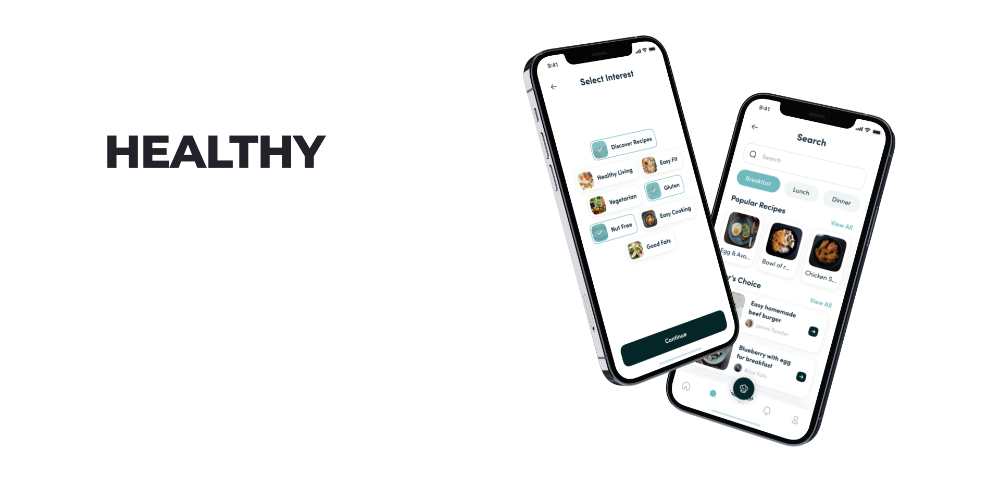

# Healthy

Motoon Mentorship Program Team Educational Project



## Links 🔗

- For comprehensive conceptual details, advanced topics, and tutorials, please refer to our [Wiki](https://github.com/motoon-eg/healthy/wiki)

- [Edamam Recipe Search API Documentation](https://developer.edamam.com/edamam-docs-recipe-api): Edamam Recipe Search API allows you to search through millions of web recipes and integrate this information into your mobile or web applications.

- [Design on Figma](<https://www.figma.com/file/KBeBh23TFLWsteQFhed9Wv/Recipely---Food-Recipe-Mobile-App-UI-Kit-(Community)?type=design&node-id=1-2&t=Pj5Mkt0UVPntDOth-0>)

## DI Container 💉
**DI container** is like a central hub that stores and manages the dependencies.

We are using [**Factory Package**](https://github.com/hmlongco/Factory) as a Dependency Injection Cantainer.

### How to use it:
Here's a simple dependency registration that returns a service that conforms to `MyServiceType`.

```swift
extension Container {
    var myService: Factory<MyServiceType> { 
        Factory(self) { MyService() }
    }
}
```

Injecting an instance of our service is straightforward, you can do it in two ways:

**1**

```swift
class ContentViewModel: ObservableObject {
    @Injected(\.myService) private var myService
    ...
}
```
**2**
```swift
class ContentViewModel: ObservableObject {
    private let myService = Container.shared.myService()
    ...
}
```

## Contributors 💫

Original [design](https://www.figma.com/community/file/1160186880726418317) was created by.
Illiyin Studio. You can reach them on [Figma](https://www.figma.com/@illiyinstudio) • [Dribble](dribbble.com/illiyinstudio) • [Instagram](https://www.instagram.com/illiyinstudio)
